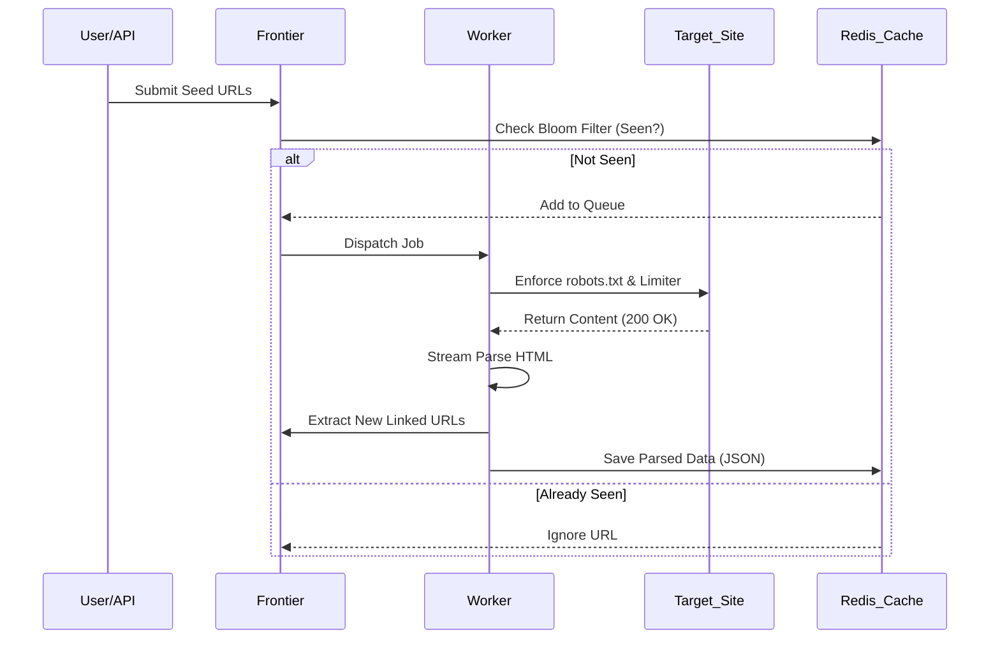

# Zypher 🕷️

> A blazing-fast, highly-concurrent, and distributed web scraping platform written in Go.


Zypher is an enterprise-grade web scraping engine designed for horizontal scalability, high-availability, and deep observability. It leverages modern concurrent design patterns like **Worker Pools**, **Circuit Breakers**, and **Adaptive Rate Limiters** to safely extract data from the web at scale.

---

## 🏗 System Architecture

Zypher integrates an advanced microservice-esque observability stack alongside a powerful core Go engine.

```mermaid
graph TD
    subgraph Core System [Zypher Scraper Engine]
        A[Frontier Controller] -->|Dispatches URLs| B(Worker Pool)
        B -->|Fetch Data| C{Adaptive Rate Limiter}
        B -->|Check Faults| D{Circuit Breaker}
        C -->|HTTP Request| E((Internet))
        D -->|HTTP Request| E
        E -->|Raw HTML| F[Stream Processor]
        F -->|Parsed Rules| G(Data Extractor)
    end

    subgraph Infrastructure & Observability [Docker Compose Stack]
        G -.->|Saves Artifacts / HTML| H[(MinIO <br> Object Storage)]
        G -.->|Caches / Bloom Filters| I[(Redis Stack <br> + Sentinel HA)]
        A -.->|State Tracking| I
        
        B -.->|Traces| J[Jaeger]
        B -.->|Metrics| K[Prometheus]
        B -.->|Logs| L[Loki]
        
        K -.-> M[Grafana Dashboard]
        L -.-> M
    end
    
    style Core System fill:#2b2d42,stroke:#edf2f4,stroke-width:2px,color:#edf2f4
    style Infrastructure & Observability fill:#8d99ae,stroke:#edf2f4,stroke-width:2px,color:#edf2f4
```

## 🔄 Execution Flow

The internal data lifecycle demonstrates how Zypher parses, crawls, and processes jobs efficiently.



---

## ✨ Key Features
- **Concurrent Worker Pools**: Efficiently utilizes system CPU cores by managing parallel crawling jobs.
- **Adaptive Rate Limiting**: Automatically scales down request concurrency based on target server health to prevent IP blacklisting.
- **Circuit Breakers**: Gracefully stops sending traffic to servers that consistently 5xx, ensuring fast failures and respecting downstream loads.
- **Frontier Management**: Deep integration with RedisBloom to check millions of URLs efficiently without duplicate tracking.
- **Distributed Tracing & Metrics**: OpenTelemetry integration reporting to Jaeger, Prometheus, and Grafana natively.
- **High Availability**: Backed by Redis Sentinel for failover and MinIO for redundant large-artifact storage.

## 🚀 Quick Start (Local Setup)

The entire infrastructure runs locally via Docker Compose.

### Prerequisites
- Docker Engine & Docker Compose
- Go 1.21+

### 1. Spin up the Dependencies
Start Redis, Grafana, Loki, Jaeger, Prometheus, and MinIO.
```bash
cd deploy
docker-compose up -d
```

### 2. Run the Application
Start the Go application natively.
```bash
go run ./cmd/scraper/main.go
```

### 3. Access the Dashboards
Once running, you can access the various local dashboards:
- **Scraper API**: `http://localhost:9090`
- **Grafana**: `http://localhost:3000` *(Default: admin / scraper123)*
- **Jaeger**: `http://localhost:16686`
- **MinIO**: `http://localhost:9001`
- **RedisInsight**: `http://localhost:8001`

---

## 📂 Project Structure

```text
zypher/
│
├── cmd/scraper/           # Entrypoint for the application
├── config/                # Main configurations (Prometheus, Grafana, Redis)
├── deploy/                # Docker compose orchestration
├── internal/              # Core logic modules
│   ├── breaker/           # Circuit breaker implementations
│   ├── frontier/          # URL queuing and Bloom Filters
│   ├── limiter/           # Adaptive rate limiters
│   ├── robots/            # Robots.txt adherence cache
│   ├── stream/            # Data stream parsers
│   └── worker/            # Concurrency worker pools
└── README.md              # You are here!
```

## 📜 License
This project is licensed under the [MIT License](LICENSE).

---
*Built with 💻 by **Tanmay Yadav**.*
